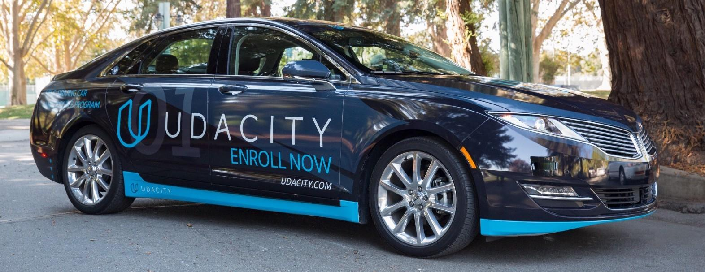
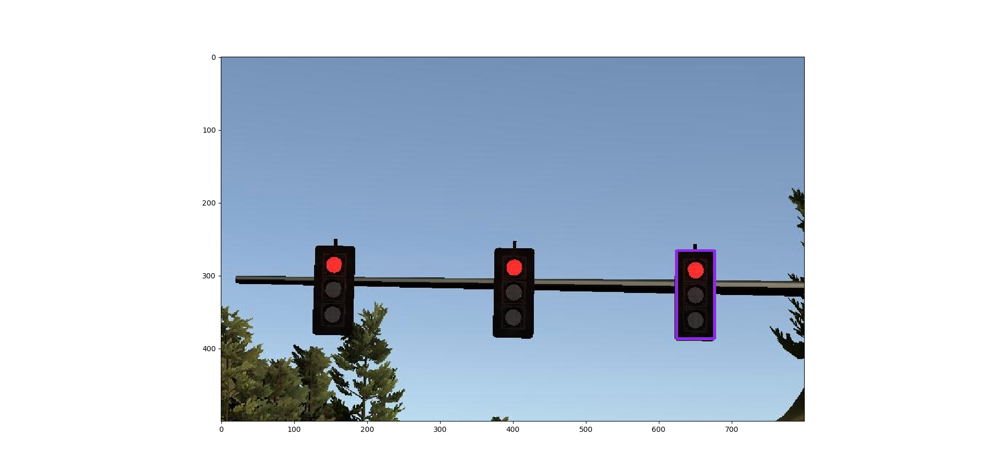
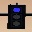

# Udacity Self-Driving Car Engineer Nanodegree 

* * *


## Final Project - Programming a Real Self-Driving Car



Programming a Real Self-Driving Car project is the final project of the Udacity Self-Driving Car Engineer Nanodegree.
We built ROS nodes to implement core functionality of the autonomous vehicle system, including traffic light detection, control, and waypoint following. 

## The Team

### ZhangLiangliang

liangliang050401@163.com

Senior System Engineer at WM Motor in ShangHai, China.

Project Contributions: Completing all work of this project independently.


## Software Architecture

*Note: For this project, the obstacle detection node is not implemented*

## Perception Subsystem

This subsystem reads the world surrounding the vehicle and publishes relevant information to other subsystems. 
Specifically, this subsystem determines the state of upcoming traffic lights and publishes their status to other subsystems.

### Traffic Light Detection Node

A crucial part of the vehicle’s self-driving capabilities comes from the ability to detect and classify upcoming traffic lights. 
This node processes images provided by the vehicle’s onboard camera and publishes upcoming traffic light information to the /traffic_waypoint topic. 
The Waypoint Updater node uses this information to determine if/when the car should slow down to safely stop at upcoming red lights. 

I took a two-stage deep learning based approach for simulator. That is, the traffic light detection (localization) module consists of  MobileNet SSD model, and (light) color classification is CNN model.

#### Traffic Light Detection (Simulator Only)

Traffic light detection takes a captured image as input and produces the bounding boxes as the output to be fed into the classification model. 
After many trial-and-errors, we decided to use SSD code provided by [Udacity Object Detection Lab]( https://github.com/udacity/CarND-Object-Detection-Lab). 

Specifically, we use a lightweight model: `ssd_mobilenet_v1_coco_11_06_2017` that is based on Single Shot Multibox Detection (SSD) framework with minimal modification. 
The COCO dataset contains images of 90 classes ranging from vehicle to human. The index for traffic light is 10. 
Though this is a general-purpose detection model (not optimized specifically for traffic light detection), we find this model sufficiently met our needs, achieving the balance between good bounding box accuracy (as shown in the following figure) and fast running time.



The traffic-light detection is implemented in `get_location(self, image)` function in CarND-Capstone/tree/master/ros/src/tl_detector/light_classification/tl_classifier.py. 
We cropped the portrait size of the image from 600 to 500 before processing.

#### Traffic Light Classification (Simulator Only)

After locating the bounding box for the traffic light, we crop the image to only include the traffic light, resize it to 32x32, 
and pass this along to the object classification step, as shown in the following figure. 



We use a simple CNN for our classification. 
It consists of three convolutional layer with (3x3 kernel), followed by dropout layer, and a flatten layer, ended by four fully connected layers. 
The architectural details of the CNN are shown in the following:
```
def model_build(self, keep_prob=0.8):
        self.model = Sequential()

        self.model.add(Conv2D(32, (3, 3), input_shape=(32, 32, 3), padding='same'))
        self.model.add(Activation('relu'))

        self.model.add(Conv2D(48, (3, 3), padding='same'))
        self.model.add(Activation('relu'))

        self.model.add(Conv2D(64, (3, 3), padding='same'))
        self.model.add(Activation('relu'))

        self.model.add(Dropout(keep_prob))

        self.model.add(Flatten())

        self.model.add(Dense(100))
        self.model.add(Activation('relu'))

        self.model.add(Dense(50))
        self.model.add(Activation('relu'))

        self.model.add(Dense(10))
        self.model.add(Activation('relu'))

        self.model.add(Dense(3))
        self.model.add(Activation('softmax'))
```

For training images, we use a dataset downloaded from web, and test on a simulator saving image.
We use Keras (with Tensorflow as backend) for training with a total of 1600 images (200 of which as validation/test samples). 
Except for normalization, we do not use other image augmentation techniques. 

We trained for 50 epochs and can achieve >99% validation/test accuracy. We save the model into the .h5 file. 
The traffic-light classification is implemented in `get_classification(self, image)` function in CarND-Capstone/tree/master/ros/src/tl_detector/light_classification/tl_classifier.py.


#### Main Loop Fuction

We add the following main loop function, which is different from the original image-callback function. 
The main goal of this main loop function is to complete all road simulations without using any image recognition function, but just using the subscribed traffic light signal.
To build an initial simulation environment for follow-up testing of traffic lihgt classify function.
```
def loop(self):
        rate = rospy.Rate(50)
        while not rospy.is_shutdown():
            if self.pose and self.waypoints and self.camera_image:
                self.publish_waypoints()
            rate.sleep()
```

## Planning Subsystem

The planning subsystem plans the vehicle’s path based on the vehicle’s current position and velocity along with the state of upcoming traffic lights. 
A list of waypoints to follow is passed on to the control subsystem.

### Waypoint Loader Node

This node was implemented by Udacity. 
It loads a CSV file that contains all the waypoints along the track and publishes them to the topic /base_waypoints. 

### Waypoint Updater Node

The bulk of the path planning happens within this node. 
This node subscribes to three topics to get the entire list of waypoints, the vehicle’s current position, and the state of upcoming traffic lights. 
Once we receive the list of waypoints, we store this result and ignore any future messages as the list of waypoints won’t change. 
This node publishes a list of waypoints to follow - each waypoint contains a position on the map and a target velocity.

Every time the vehicle changes its position, we plan a new path. 
First, we find the closest waypoint to the vehicle’s current position and build a list containing the next 20 waypoints. 
Next, we look at the upcoming traffic lights. 
If there are any upcoming red lights, we adjust the speed of the waypoints immediately before the traffic light to slow the vehicle to a halt at the red light. 

The final list of waypoints is published on the /final_waypoints topic.

## Control Subsystem

This subsystem publishes control commands for the vehicle’s steering, throttle, and brakes based on a list of waypoints to follow. 

### Waypoint Follower Node

This node was given to us by Udacity. It parses the list of waypoints to follow and publishes proposed linear and angular velocities to the /twist_cmd topic

### Drive By Wire (DBW) Node

The DBW node is the final step in the self driving vehicle’s system. At this point we have a target linear and angular velocity and must adjust the vehicle’s controls accordingly. 
In this project we control 3 things: throttle, steering, brakes. As such, we have 3 distinct controllers to interface with the vehicle.

#### Throttle Controller

The throttle controller is a simple PID controller that compares the current velocity with the target velocity and adjusts the throttle accordingly. 
The throttle gains were tuned using trial and error for allowing reasonable acceleration without oscillation around the set-point.

#### Steering Controller

This controller translates the proposed linear and angular velocities into a steering angle based on the vehicle’s steering ratio and wheelbase length. 
To ensure our vehicle drives smoothly, we cap the maximum linear and angular acceleration rates. The steering angle computed by the controller is also passed through a low pass filter to reduce possible jitter from noise in velocity data.

#### Braking Controller

This is the simplest controller of the three - we simply proportionally brake based on the difference in the vehicle’s current velocity and the proposed velocity.

## Testing on Simulator

1. Clone the project repository
```bash
git clone https://github.com/Flash-zhangliangliang/Flash-CarND-Capstone.git
```

2. Install python dependencies
```bash
cd CarND-Capstone
pip install -r requirements.txt
```
3. Make and run styx
```bash
cd ros
catkin_make
source devel/setup.sh
roslaunch launch/styx.launch
```
4. Run the simulator

## Known Issues

The max speed restriction of vehicle is 40kmph (about 24.8mph).
